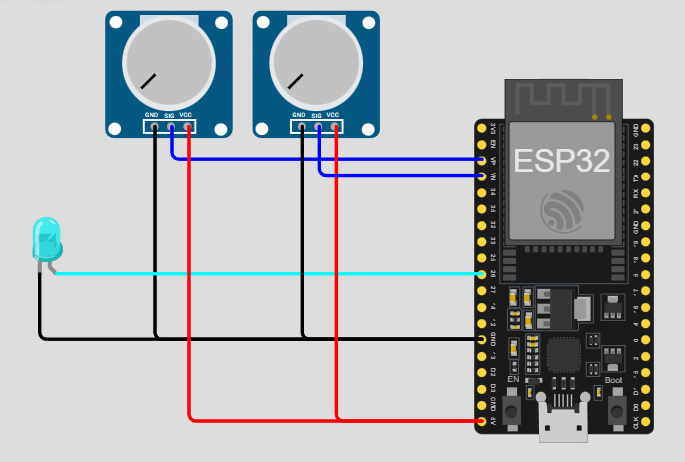
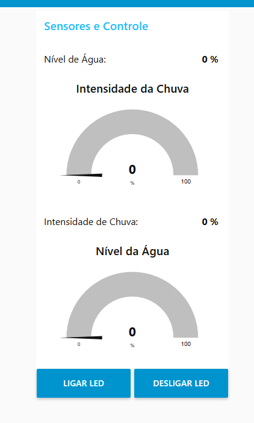

# SAFE-ROUTE-IoT

Sistema IoT para monitoramento do nível de água e intensidade da chuva utilizando ESP32 e sensores simulados. Os dados são enviados via MQTT para o Node-RED, que exibe um dashboard em tempo real.

## Projeto IoT - Monitoramento de Nível de Água e Chuva

Este projeto faz parte da solução SafeRoute — uma plataforma de alertas inteligentes e evacuação segura. O objetivo da SafeRoute é otimizar a comunicação e organizar rotas seguras de evacuação durante eventos climáticos extremos, como enchentes e tempestades severas.

Para demonstrar um exemplo funcional desse conceito, desenvolvemos um protótipo IoT que simula a medição de níveis de chuva e água, com acionamento de um alerta visual (LED) quando a situação atinge níveis críticos.

O sistema utiliza sensores simulados (potenciômetros no Wokwi) para representar a intensidade da chuva e o nível da água. Esses dados são enviados via protocolo MQTT para um broker e exibidos em tempo real em um dashboard no Node-RED.

A lógica funciona da seguinte forma:

A leitura da chuva é apenas informativa, simulando o aumento potencial do nível da água.

Quando o nível da água ultrapassa 75%, o sistema aciona um LED no simulador e exibe a informação no painel do dashboard, simulando um alerta visual de perigo ou evacuação.

Essa abordagem foi escolhida para ilustrar de forma didática e funcional como uma solução baseada em IoT pode ser aplicada para monitoramento ambiental e emissão automatizada de alertas de risco, integrando hardware, protocolos de comunicação e visualização em tempo real.

## Imagens do Projeto

## Link do vídeo 

https://youtu.be/FIq3crhJuA0

### ESP32 e sensores simulados


### Dashboard do Node-RED


## Integrantes

- RM553542 Luiz Otávio Leitão Silva - 2TDSPR
- RM553748 Mauricio Vieira Pereira - 2TDSPC
- RM553483 Vitor de Melo Marques - 2TDSPR

## Tecnologias Utilizadas 

- Wokwi (Simulador de Arduino/ESP32)
- ESP32
- Node-RED
- Node-RED Dashboard
- MQTT Broker

## Configuração e Execução

### Wokwi

1. Instale as bibliotecas 'WiFi' e 'PubSubClient' 
2. Utilize a rede WiFi 'Wokwi-GUEST' e senha ''
3. Compile e envie para o ESP32
4. Verifique no monitor serial as leituras de "Chuva" e "Nível de Água"

### Node-RED

1. Abra o CMD e digite ```node-red ```
2. Abra local  ```http://localhost:1880```
. Importe o fluxo do arquivo `flow_node_red.json`
2. Configure o broker MQTT (exemplo usado: test.mosquitto.org)
3. Utilize a porta 1883
4. Rode o projeto no Node-RED
5. Abra o dashboard ```http://localhost:1880/ui/``` no navegador, para visualizar os dados e receber alertas

## Fluxo Node-RED

- Node MQTT subscribe para os tópicos `projeto/nivelagua` e `projeto/chuva`
- Processamento para acionar alerta quando nível de água > 75%
- Dashboard para mostrar dados em tempo real e status do LED

## Lógica da Execução do Projeto SafeRoute

1. **Leitura dos Sensores no ESP32:**
   - O ESP32 está conectado a dois potenciômetros que simulam dois sensores:
     - **Sensor de chuva**: Representa o índice de chuva. Não dispara alertas diretamente, mas influencia o comportamento do sistema.
     - **Sensor de nível de água**: Mede o percentual do nível da água acumulada.
   - O ESP32 lê os valores analógicos dos potenciômetros periodicamente.

2. **Envio dos Dados via MQTT:**
   - O ESP32 envia os valores lidos dos sensores para um broker MQTT, em tópicos específicos, usando o protocolo MQTT e formato JSON.
   - Isso permite comunicação eficiente e padronizada com o gateway.

3. **Recepção e Processamento dos Dados no Node-RED:**
   - O Node-RED atua como gateway, recebendo as mensagens MQTT dos sensores.
   - Ele extrai os valores e processa a lógica de alerta:
     - A chuva é apenas um indicador para mostrar que o nível da água pode subir.
     - Quando o nível de água ultrapassa 75%, o Node-RED aciona o LED virtual no dashboard para alertar o usuário.

4. **Dashboard para Visualização em Tempo Real:**
   - Os dados de chuva e nível de água são exibidos em um painel gráfico e numérico.
   - O LED no dashboard acende automaticamente quando o nível da água está acima do limite crítico (75%).
   - Isso oferece uma interface visual simples e intuitiva para monitoramento.

5. **Funcionalidade Prática:**
   - O sistema simula a detecção de condições críticas em tempo real.
   - Serve como base para sistemas reais de alerta em situações de risco como enchentes.
   - Pode ser expandido para outros sensores e atuadores, aumentando a segurança e automação.

## Arquitetura do Sistema


**Fluxo de Dados:**
1. Sensores simulados no Wokwi
2. Dados enviados via ESP32
3. Broker MQTT (test.mosquitto.org)
4. Processamento no Node-RED
5. Visualização no Dashboard


